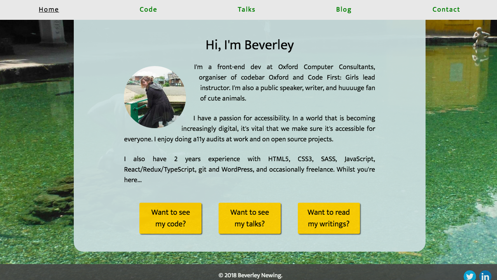

# Personal Website

This is my personal website. It contains my CV, info about my code portfolio, links to all of the blog posts that I've written on various sites and a contact page with a contact form. It passes Level 1 and Level 2 of the [IndieWeb](https://indiewebify.me/)

You can view the site here:

[https://webdevbev.co.uk](https://webdevbev.co.uk)

## 1. Technologies Used

- HTML
- Bootstrap
- SASS
- Gulp
- [Formspree.io](https://formspree.io/)
- [Webmention.io](https://webmention.io)

## 2. Folder Structure

I've put all of the things that won't change, which for now is just images, into the folder called 'static'.

I've then put all of my CSS/SASS in a 'styles' folder. The SASS is broken down into components and so all of the SASS files are in a sub folder called 'components'. The compiled CSS file is just in the 'styles' folder though.

Finally, I've left my HTML files in the top level folder, along with my config files like my gulp file and package.json file. This keeps it all tidy and makes it clearer what lives where!

## 3. How to Set Up the Dev Environment

After cloning the project, you'll need to run: 

`npm install`

from the command line.

Every time you change the SASS, you'll need to run: 

`gulp sass`

to recompile the CSS. This will also run autoprefixer and sourcemaps.

## 4. How to Suggest a Change

Feedback is very welcome! To suggest a change, either raise an issue, or fork and clone the project and create a pull request using the steps listed here:

https://help.github.com/articles/creating-a-pull-request-from-a-fork/

## 5. What the Project Looks Like

