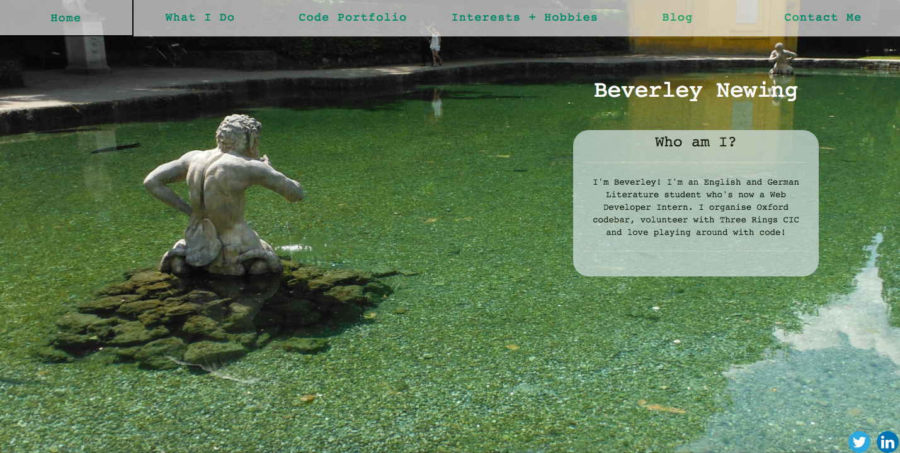

# Personal Website

This is my personal website. It contains my CV, info about my code portfolio, links to all of the blog posts that I've written on various sites and a contact page with a contact form.

You can view the project here:

[https://bnewing.github.io](https://bnewing.github.io)

## 1. Technologies Used

- HTML
- SASS
- Gulp
- [Formspree.io](https://formspree.io/)

## 2. How to Set Up the Dev Environment

After cloning the project, you'll need to run: 

`npm install`

from the command line.

Every time you change the SASS, you'll need to run: 

`gulp sass`

to recompile the CSS.

## 3. How to Suggest a Change

Feedback is very welcome! To suggest a change, either raise an issue, or fork and clone the project and create a pull request using the steps listed here:

https://help.github.com/articles/creating-a-pull-request-from-a-fork/

## 4. What the Project Looks Like

-Test
